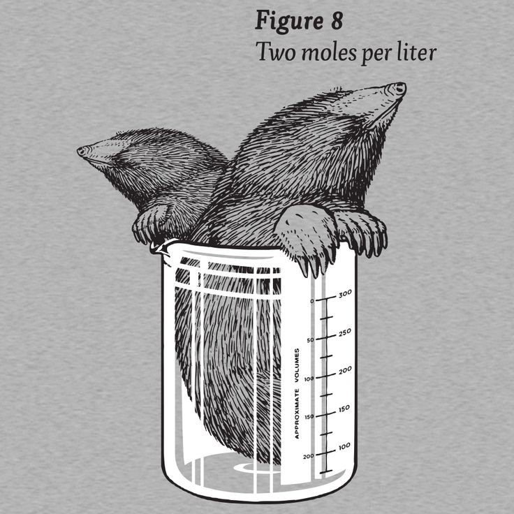

# concentration

Concentrations basically answer the question:

::: {.card-info}
How much of something is there in a given volume?
:::

::: {.curved-paper}
{height=400px}
:::

Concentrations are very commonly used in chemistry. The quantities can be moles, grams, milligrams, etc. The volumes can be liters, milliliters, etc. A few examples:

* concentration of a given medical compound: 2 $\mu$g/mL
* concentration of a reagent: 0.5 mol/L
