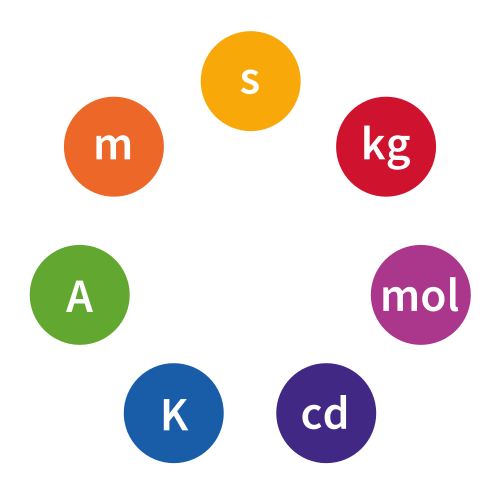

# SI

The SI (Système International d'Unités) is the modern form of the metric system and the most widely used system of measurement for science and engineering.
It defines seven base units:

* meter for length,
* kilogram for mass,
* second for time,
* ampere for electric current,
* kelvin for temperature,
* mole for amount of substance,
* candela for luminous intensity.

All other units are derived from these basic seven units.

The SI provides a standardized way to express and compare physical quantities across disciplines and countries.

## other systems

Before the French Revolution, a person traveling across towns and countries would encounter a myriad of local system of units.
Most often, the names for the units used in neighboring towns were exactly the same, but the exact quantities were not.
So a pound of cheese here might be 20% higher than a pound from elsewhere.

While most of the world uses today the SI units, the United States and a few other countries still use older unit systems. 